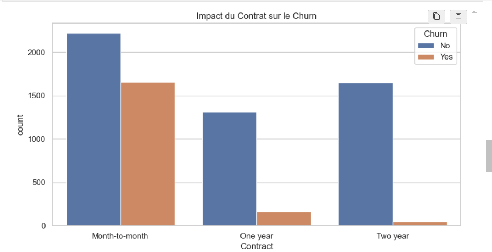
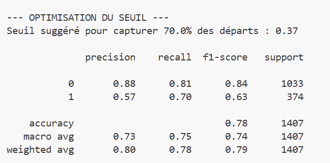
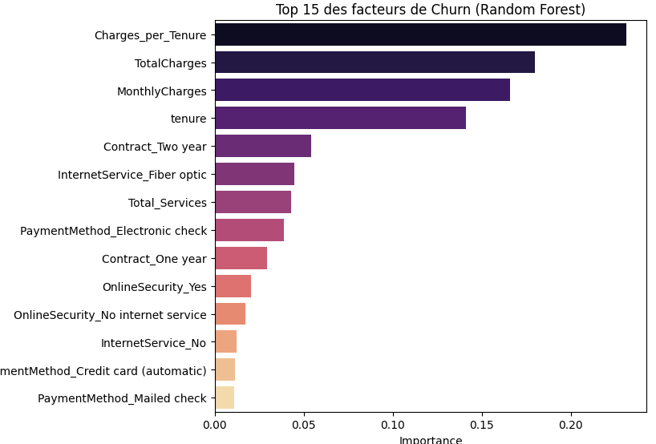

 

# Customer Churn Prediction - Telco

Un projet de Machine Learning pour prédire le risque de désabonnement (churn) des clients d'une entreprise de télécommunications.

## 📋 Vue d'ensemble

Ce projet utilise des algorithmes de classification (Random Forest et XGBoost) pour identifier les clients à risque de partir, permettant ainsi à l'entreprise de mettre en place des actions de rétention ciblées.

**Dataset**: Telco Customer Churn (IBM Sample)  
**Objectif**: Prédire si un client va se désabonner (Churn = Yes/No)  
**Métrique principale**: AUC-ROC Score

## 📂 Structure du projet

```
doc/
├── data/
│   └── WA_Fn-UseC_-Telco-Customer-Churn.csv
├── preprocessing/
│   ├── __init__.py
│   ├── preprocessing.py          # Pipeline de préparation des données
│   └── view_data.ipynb           # Analyse exploratoire (EDA)
├── models/
│   ├── train_model.py            # Entraînement des modèles
│   └── predict.py                # Scoring de nouveaux clients
├── Résultats/
│   ├── Figure_1.png              # Matrice de confusion
│   ├── Figure_2.png              # Importance des features
│   └── Facteurs_Churn1.png       # Visualisations EDA
├── churn_model_v1.pkl            # Modèle Random Forest
├── churn_model_xgb_final.pkl     # Modèle XGBoost (meilleur)
└── requirements.txt
```

## 🚀 Installation

```bash
# Cloner le repository
git clone <votre-repo>
cd doc

# Créer un environnement virtuel (recommandé)
python -m venv .venv
source .venv/bin/activate  # Linux/Mac
# ou
.venv\Scripts\activate     # Windows

# Installer les dépendances
pip install -r requirements.txt
```

## 📊 Analyse exploratoire (EDA)

Ouvrir le notebook `preprocessing/view_data.ipynb` pour voir:
- Distribution des variables numériques (tenure, charges)
- Déséquilibre des classes (26.5% de churn)
- Impact des variables clés:
  - **Contract**: Les clients "Month-to-month" partent massivement
  - **MonthlyCharges**: Les clients qui paient cher sont plus à risque
  - **Tenure**: Les nouveaux clients (< 6 mois) sont vulnérables



## 🛠️ Prétraitement des données

Le fichier `preprocessing/preprocessing.py` contient:

1. **Nettoyage**:
   - Conversion de `TotalCharges` (object → float)
   - Gestion des valeurs manquantes (11 lignes supprimées)

2. **Feature Engineering**:
   - `Charges_per_Tenure` = TotalCharges / tenure
   - `Total_Services` = Somme des services additionnels
   - `Is_Long_Term` = 1 si tenure > 12 mois

3. **Encodage**:
   - Variables numériques: StandardScaler
   - Variables catégorielles: OneHotEncoder

```python
from preprocessing.preprocessing import prepare_data

X_train, X_test, y_train, y_test = prepare_data('data/WA_Fn-UseC_-Telco-Customer-Churn.csv')
```

## 🎯 Entraînement des modèles

### Random Forest (baseline)
```bash
python models/train_model.py
```

**Résultats** (voir code ligne 1-50):
- AUC Score: **0.80**
- Précision classe 1 (churn): 58%
- Recall classe 1: 46%

### XGBoost avec GridSearchCV (modèle final)

Hyperparamètres optimisés:
```python
param_grid = {
    'classifier__n_estimators': [100, 200],
    'classifier__learning_rate': [0.01, 0.1],
    'classifier__max_depth': [3, 5]
}
```

**Résultats** (voir code ligne 51-fin):
- AUC Score: **0.8381** ✅
- Précision classe 1: 64%
- Recall classe 1: 52%

### Optimisation du seuil de décision

Au lieu du seuil par défaut (0.5), nous utilisons **0.37** pour maximiser le recall:
- Permet de capturer **70% des clients qui partent** (vs 52% avant)
- Trade-off: Augmente les faux positifs mais réduit les pertes de clients



"Nous avons arbitré en faveur du Rappel plutôt que de la Précision. En abaissant le seuil de décision à 0.37, nous avons augmenté notre capacité à détecter les clients sur le départ de 52% à 70%. Bien que cela génère plus de 'fausses alertes', le coût d'une campagne de rétention (coupon, appel) est largement inférieur au coût d'acquisition d'un nouveau client."
## 📈 Top 5 Features importantes

D'après l'analyse XGBoost:
1. **Charges_per_Tenure** (0.25) → Ratio prix/ancienneté
2. **TotalCharges** (0.15) → Montant total payé
3. **MonthlyCharges** (0.12) → Facture mensuelle
4. **tenure** (0.10) → Ancienneté client
5. **Contract_Two year** (0.05) → Type de contrat


## 💡 Stratégie de Rétention (Insights Business)

Le modèle identifie trois leviers majeurs pour réduire le churn :
1. **Migration de Contrat** : Inciter les clients "Month-to-month" (plus à risque) vers des contrats d'un ou deux ans via des remises ciblées.
2. **Support Fibre Optique** : La fibre étant un facteur de churn élevé, améliorer la qualité du service technique pour cette catégorie.
3. **Optimisation du "Charges_per_Tenure"** : Surveiller les clients dont le ratio prix/ancienneté augmente brutalement.

## 📋 Prochaines étapes

- [ ] Déployer le modèle avec FastAPI/Flask
- [ ] Créer un dashboard Streamlit pour le scoring en temps réel
- [ ] Tester SMOTE pour équilibrer les classes
- [ ] Ajouter des features temporelles (saisonnalité)
- [ ] Monitorer le model drift en production


---

**Auteur**: ETTAOUSSI SOUKAINA  
**Contact**: ettaoussisoukaina7@gmail.com
